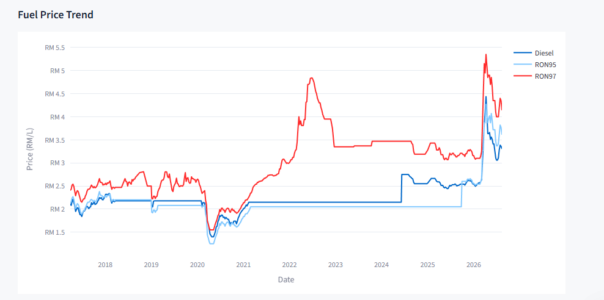
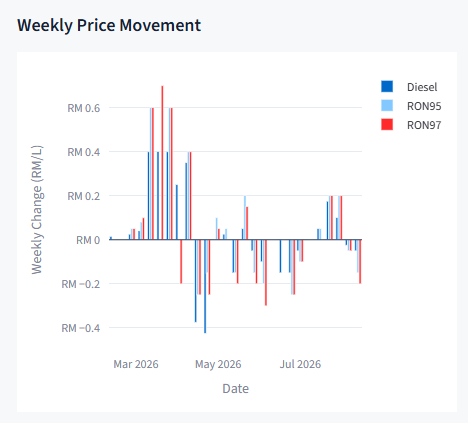
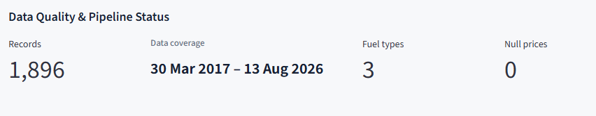

# FuelPulse MY

## Malaysian Fuel Price Analytics Platform

FuelPulse MY is an end-to-end data engineering project for processing, validating, transforming, and analysing Malaysian retail fuel price data.

The project demonstrates a practical data pipeline from data ingestion and validation through transformation and cloud data warehousing, followed by analytical visualisation through an interactive Streamlit dashboard.

---

## Project Overview

FuelPulse MY processes historical Malaysian retail fuel price records and prepares the data for analytical use.

The current dataset contains:

- **1,896 records**
- **474 unique dates**
- **3 fuel types**
- **3 regions**
- **0 null fuel prices**
- **Data coverage:** 30 March 2017 – 13 August 2026

The dashboard provides:

- Historical fuel price trends
- Weekly price movements
- Latest fuel prices
- Market-level statistics
- Data quality and pipeline status

---

## Architecture

```text
Source Data
    │
    ▼
Python Data Extraction
    │
    ▼
Data Validation
    │
    ▼
Data Transformation
    │
    ▼
Snowflake RAW Layer
    │
    ▼
Snowflake ANALYTICS Layer
    │
    ▼
Streamlit Dashboard
```

---

## Technology Stack

| Component | Technology |
|---|---|
| Data Extraction | Python |
| Data Processing | Python, Pandas |
| Data Validation | Python |
| Data Warehouse | Snowflake |
| Dashboard | Streamlit |
| Visualisation | Plotly |
| Environment Management | Python virtual environment |
| Version Control | Git, GitHub |

---

## Project Structure

```text
fuelpulse-my/
│
├── dashboard/
│   └── app.py
│
├── src/
│   ├── extract_fuel_prices.py
│   ├── inspect_fuel_prices.py
│   ├── transform_fuel_prices.py
│   └── validate_fuel_prices.py
│
├── databricks/
├── snowflake/
├── docs/
├── data/
│
├── upload_to_snowflake.py
├── requirements.txt
├── .env.example
├── .gitignore
└── README.md
```

---

## Data Pipeline

### 1. Data Extraction

Fuel price data is collected and prepared for downstream processing using Python.

### 2. Data Validation

The pipeline performs validation checks on the dataset before loading it into the warehouse. These checks help identify missing values, invalid records, and potential data quality issues.

### 3. Data Transformation

The validated data is transformed into a consistent structure suitable for analytical queries and reporting.

### 4. Snowflake Data Warehouse

Processed data is loaded into Snowflake and organised into separate layers:

- **RAW Layer** — stores ingested data
- **ANALYTICS Layer** — provides structured data for analysis

### 5. Dashboard

The Streamlit dashboard connects to the analytical layer and provides interactive views of Malaysian fuel price trends and market statistics.

---

## Dashboard Preview

### Latest Fuel Prices

The dashboard displays the latest available Malaysian fuel prices for RON95, RON97, and Diesel, together with week-over-week changes.


### Fuel Price Trend

The interactive time-series chart shows historical fuel price movements from 2017 to 2026.



### Weekly Price Movement & Market Overview

The dashboard provides weekly price changes and summary statistics including average, minimum, and maximum prices by fuel type.



### Data Quality & Pipeline Status

The dashboard reports pipeline-level data quality indicators including total records, data coverage, number of fuel types, and null price counts.



### Latest Fuel Prices

Displays the latest available prices for:

- RON95
- RON97
- Diesel

### Fuel Price Trend

Shows historical fuel price movements across the available dataset.

### Weekly Price Movement

Highlights week-over-week changes in fuel prices.

### Market Overview

Provides average, minimum, and maximum prices by fuel type.

### Data Quality & Pipeline Status

Displays key data quality indicators including:

- Total records
- Data coverage
- Number of fuel types
- Null price count

---

## Data Quality

The current analytical dataset reports:

| Metric | Value |
|---|---:|
| Records | 1,896 |
| Unique Dates | 474 |
| Fuel Types | 3 |
| Regions | 3 |
| Null Prices | 0 |
| Data Coverage | 30 Mar 2017 – 13 Aug 2026 |

These metrics are also displayed directly in the dashboard.

---

## Running the Dashboard

### 1. Clone the repository

```bash
git clone https://github.com/Sabrinaradzali/fuelpulse-my.git
cd fuelpulse-my
```

### 2. Create a virtual environment

```bash
python -m venv .venv
```

Activate the environment on Windows:

```powershell
.venv\Scripts\Activate.ps1
```

### 3. Install dependencies

```bash
pip install -r requirements.txt
```

### 4. Configure environment variables

Create a `.env` file based on `.env.example` and provide the required Snowflake connection details.

Do not commit `.env` or private credentials to GitHub.

### 5. Run the dashboard

```bash
streamlit run dashboard/app.py
```

The application will be available locally at:

```text
http://localhost:8501
```

---

## Security

Credentials and sensitive configuration are excluded from version control.

The repository uses environment variables for configuration, while `.env` files and private key files are excluded through `.gitignore`.

A `.env.example` file is provided as a template for local configuration.

---

## Project Focus

This project focuses on the practical implementation of a small-scale data engineering workflow, including:

- Data ingestion
- Data validation
- Data transformation
- Cloud data warehousing
- Analytical data modelling
- Dashboard development
- Data quality monitoring
- Reproducible project structure

---

## Project Status

**Status:** Completed

The current implementation includes the data pipeline, Snowflake integration, analytical layer, and Streamlit dashboard.

---

## Author

**Nur Sabrina Radzali**

Bachelor of Computer and Communication Systems Engineering  
Universiti Putra Malaysia

GitHub: https://github.com/Sabrinaradzali
